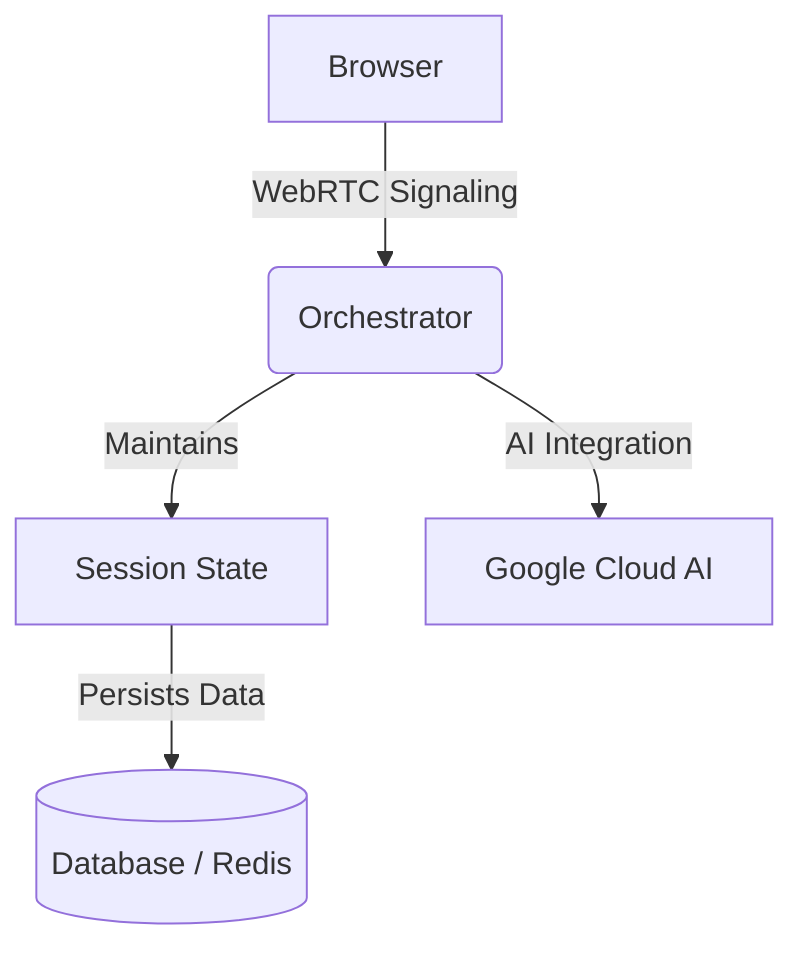

# CLAUDE.md - VocaHire Development Guide

**Last Updated**: May 28, 2025 8:00 AM CST  
**Target Launch**: June 1, 2025 (Public Beta) 🎯

## 🎉 Current Status

**Overall Status**: ✅ SUCCESSFULLY DEPLOYED TO CLOUD RUN! 🚀

### Production URLs
- **Cloud Run**: https://v0-vocahire-727828254616.us-central1.run.app/
- **Custom Domain**: https://vocahire.com (DNS propagating, SSL pending)
- **WWW Domain**: https://www.vocahire.com (DNS propagating, SSL pending)

### Resolved Blockers

1. **✅ Next.js 15.3.2 Issue** - Downgraded to 15.2.3
2. **✅ Cloud Build CI/CD** - Working with custom inline config
3. **✅ TypeScript Errors** - All strict mode errors fixed
4. **✅ Authentication** - Clerk integration working
5. **✅ Docker Build** - Optimized Dockerfile with proper Clerk key handling

## 🤝 Collaborative Development Protocol

**Team**: Claude (Anthropic) & Gemini (Google) working asynchronously

### Git Workflow

```bash
# Before ANY work:
git pull origin main --rebase

# After completing work:
git add .
git commit -m "type(scope): description - by Claude/Gemini - 2025-05-26"
git push origin main
```

### Communication

- Use TODO comments: `// TODO: [Claude/Gemini] - description`
- Document decisions in commit messages
- Mark critical tasks with `[PIVOT-CRITICAL]`
- Create summary files (e.g., `first-tasks.md`, `next-steps1.md`)

## 💡 Key Principles

- **PRD as Source of Truth**: All features and non-functional requirements (NFRs) are derived from PRD v1.0.
- **Low Latency First**: Prioritize performance and responsiveness, especially for voice interactions.
- **Security & Privacy by Design**: Implement robust measures for user data protection (audio, PII).
- **Robust Error Handling**: Ensure graceful degradation and clear feedback for all failures.
- **Developer Ergonomics**: Maintain clean, testable, and maintainable code.

## 🏗️ Current Architecture Status

### Phase 1: Containerization ✅

- Monolithic Dockerfile created
- Docker Compose for local development
- Build scripts for Cloud Run deployment
- API specification documented
- Latest changes in progress of dockerizing the project

### Phase 2: Client Refactoring ✅ (Completed May 26, 2025)

- ✅ Removed ALL OpenAI dependencies
- ✅ Updated to use new orchestrator API
- ✅ Simplified state management
- ✅ WebRTC client implementation ready

### Phase 3: Backend Orchestrator (In Progress - Gemini)

- Implement WebRTC server
- Integrate Google Cloud AI services
- Deploy to Cloud Run

### Phase 4: MVP Optimization ✅ (Completed May 27, 2025)

- ✅ Simplified Docker setup for rapid iteration
- ✅ Single-stage Dockerfile.dev for hot reload
- ✅ Streamlined docker-compose.dev.yml
- ✅ Quick commands via Makefile
- ✅ Updated Next.js to 15.3.2

## 📋 Recent Accomplishments

### May 27, 2025 - End of Day Summary (11:59 PM CST) - *Detailed Log*

#### ✅ Morning: MVP Foundation (9:00 AM - 12:00 PM)

1. **Docker Infrastructure Simplified**
    - Single-stage `Dockerfile.dev` for hot reload development
    - Streamlined `docker-compose.dev.yml` with bind mounts
    - Created `Makefile` for quick commands
    - Fixed port conflicts: Web (3001), DB (5433), Redis (6380)

2. **Authentication System Productionized**
    - Integrated Clerk authentication (dev keys configured)
    - Fixed Prisma binary targets for Docker compatibility
    - Removed all development auth bypasses
    - Fixed profile and interview pages to use real user data
    - **Known Issue**: Clerk redirect loop to vocahire.com

#### ✅ Afternoon: AI Integration (2:00 PM - 6:00 PM)

1. **Gemini 2.5 Flash Native Audio Model**
    - Primary: `gemini-2.5-flash-preview-native-audio-dialog`
    - Fallback: `gemini-2.0-flash-live-001`
    - Simplified prompts - model handles conversation naturally
    - Automatic fallback on connection errors

2. **Cloud Run Migration Preparation**
    - Created `scripts/build-cloud-run.sh` (replaces Vercel)
    - Updated `package.json` default build to Cloud Run
    - Created `CLOUD_RUN_DEPLOYMENT_GUIDE.md`
    - Fixed Genkit imports (`@genkit-ai/core` → `genkit`)
    - Resolved Prisma async issues with deep proxy

#### ✅ Evening: TypeScript Strict Mode Fixes (6:00 PM - 11:59 PM)

1. **Resolved All TypeScript Errors**
    - Fixed implicit 'any' types across API routes
    - Added proper Prisma type imports (`TransactionClient`)
    - Fixed Zod schema pick type issue in SessionSetup
    - Resolved ArrayBuffer/SharedArrayBuffer compatibility
    - Total fixes: 6 TypeScript strict mode errors

2. **Files Updated**
    - `/app/api/credits/purchase/route.ts` - Transaction types
    - `/app/api/feedback/enhance/route.ts` - Transcript types
    - `/app/api/interviews/route.ts` - InterviewSession types
    - `/app/interview-v2/components/SessionSetup.tsx` - Zod types
    - `/app/interview-v2/hooks/useAudioStream.ts` - Buffer types

### May 28, 2025 - Cloud Run Production Deployment Success! (8:00 AM CST)

#### Key Fixes That Enabled Successful Deployment

1. **TypeScript Compilation Errors**
   - Fixed `parsed.data` vs `parsed.control` in useGenkitRealtime.ts
   - Added 'Leadership' to interviewType enum
   - Fixed session feedback handling
   - Removed circular dependencies in React hooks

2. **Build Configuration**
   - Removed module-level Stripe validation preventing builds
   - Added Clerk publishable key as Docker build ARG
   - Fixed Prisma client copy path in Dockerfile
   - Updated Cloud Build inline config with proper build args

3. **Production Access**
   - Made Cloud Run service public with IAM binding
   - Added health/ready endpoints to public routes in middleware
   - Set up custom domain mapping for vocahire.com

#### Successful Builds
- ✅ Build 575ccc8d: First successful Cloud Run deployment
- ✅ Build f1cb6ed6: Fixed React hook dependencies
- ✅ Build 74eb5196: Added public health endpoints

#### Infrastructure Achievements
- Created comprehensive maintenance documentation
- Set up staging environment configuration
- Implemented image retention/cleanup scripts
- Configured health checks and monitoring
- Added rollback procedures

### May 26, 2025 - Client Refactoring

#### Claude's Completed Tasks

1. **✅ Refactored `useRealtimeInterviewSession.ts`**
    - Removed all OpenAI logic
    - Implemented WebRTC connection to backend
    - Added WebSocket authentication
    - Set up data channel for heartbeat

2. **✅ Updated `InterviewPageClient.tsx`**
    - Simplified state management
    - Clean integration with new hook
    - Better error handling

3. **✅ Updated `InterviewRoom.tsx`**
    - Works with new hook API
    - Simplified prop interface
    - Proper status tracking

#### Gemini's Completed Tasks (from first-tasks.md)

1. **✅ Created all API endpoints**
    - `/api/v1/sessions/create`
    - `/api/v1/sessions/:sessionId`
    - `/api/v1/sessions/:sessionId/end`
    - `/health` and `/ready`

2. **✅ Redis session store implementation**
3. **✅ Initial WebSocket endpoint setup**

## 🚀 New Architecture Overview

This section outlines the revised system architecture for handling real-time interview sessions:

### Key Components

- **Browser**: The client application built with Next.js.
- **WebRTC Module**: Handles peer-to-peer communication for real-time interactions.
- **Orchestrator**: Acts as the central hub for session management and signaling.
- **Google Cloud AI**: Provides advanced AI services to assist during interviews.
- **Session State Manager**: Maintains and synchronizes session data.
- **Database / Redis**: Persists session information and manages caching.

### System Workflow Diagram



### Benefits

- **Low Latency**: Direct peer-to-peer connections for quick responses.
- **Scalability**: Efficient session state management and persistent storage.
- **Enhanced Interactions**: Integrated AI enhances the interview experience.

Browser → WebRTC → Orchestrator → Google Cloud AI
                         ↓
                    Session State
                         ↓
                    Database/Redis

### Key Services

1. **Frontend**: Next.js client app (Ready ✅)
2. **Orchestrator**: WebRTC + Google AI integration (Pending)
3. **API Gateway**: Authentication, credits, routing (Ready ✅)

### API Contract

- **Specification**: `/docs/orchestrator-api-spec.md`
- **Session Creation**: `POST /api/v1/sessions/create`
- **WebSocket**: `wss://orchestrator/ws/{sessionId}`
- **SDP Exchange**: Via WebSocket messages

## 💻 Development Commands

### 🚀 MVP Quick Start (Recommended)

```bash
# First time or deps changed
make dev-build

# Daily development (hot reload on http://localhost:3001)
make dev

# Common tasks
make shell      # Container shell
make migrate    # Run migrations
make studio     # Prisma Studio
make test       # Run tests
make help       # Display help for Makefile commands

# Build for production
npm run build   # Cloud Run optimized build (NEW!)
```

### Build Scripts

- **`npm run build`** - Production build for Cloud Run (uses `scripts/build-cloud-run.sh`)
- **`npm run build:vercel`** - Legacy Vercel build (deprecated, do not use)

### Alternative Commands

```bash
# NPM scripts
npm run docker:dev      # Same as make dev
npm run docker:build    # Force rebuild
npm run docker:shell    # Container shell

# Direct Docker
./scripts/docker-dev.sh up     # Start services
./scripts/docker-dev.sh build  # Rebuild
./scripts/docker-dev.sh down   # Stop services
```

## 🔑 Environment Variables

### Essential for Development

*Note: A `.env.example` file should be maintained with all required environment variables.*

```env
# Database
DATABASE_URL=
MIGRATE_DATABASE_URL=

# Google Cloud
GOOGLE_PROJECT_ID=
GOOGLE_APPLICATION_CREDENTIALS=

# Authentication (Clerk)
NEXT_PUBLIC_CLERK_PUBLISHABLE_KEY=
CLERK_SECRET_KEY=

# Payments (Stripe)
STRIPE_SECRET_KEY=
NEXT_PUBLIC_STRIPE_PUBLISHABLE_KEY=

# Redis (for session store)
REDIS_URL=
```

## 📁 Key Files

### Client-Side (Claude's Domain) ✅

- `/hooks/useRealtimeInterviewSession.ts` - WebRTC management
- `/app/interview/InterviewPageClient.tsx` - Session UI
- `/components/InterviewRoom.tsx` - Interview interface

### Backend (Gemini's Domain) 🚧

- `/docs/orchestrator-api-spec.md` - API contract
- `/app/api/v1/sessions/*` - Session endpoints
- `/app/api/webrtc-exchange/[sessionId]/route.ts` - WebSocket handler
- `/lib/redis.ts` - Session store
- `/lib/google-cloud-utils.ts` - Google AI integration (TODO)

### Shared

- `/prisma/schema.prisma` - Database schema
- `/lib/prisma.ts` - Database client
- Authentication & payment logic

## ⚠️ Migration Notes

### Deprecated (Do Not Use)

- OpenAI Realtime API
- `/lib/openai-*.ts` files
- Direct WebRTC to OpenAI
- `interview-session-manager.ts` (removed)
- Sentry monitoring (removed May 27)
- Vercel build scripts (use Cloud Run scripts instead)
- Complex interview prompts (Gemini 2.5 handles naturally)

### Stable Components

- Clerk authentication (dev keys configured)
- Stripe payments
- Database schema
- UI components

### Known Issues

1. **Clerk Redirect Loop** (May 27, 11am CST)
    - After sign-in, redirects to non-existent vocahire.com
    - Using `forceRedirectUrl` in SignIn/SignUp components
    - TODO: Configure Clerk production instance redirect URLs properly

## 🎯 Success Metrics

- **Latency**: < 1.5s speech-to-speech
- **Reliability**: 99.9% uptime
- **Cost**: 30-50% reduction vs OpenAI
- **UX**: Seamless transition for users

## 📝 Quick Reference

### Credit System

- New users: 3.00 VocahireCredits
- Interview cost: 1.00 credit
- Minimum required: 0.50 credits
- Premium: Unlimited interviews

### WebSocket Message Types

**Client → Server**:

- `webrtc.offer`
- `webrtc.ice_candidate`
- `control.start_interview`
- `control.end`

**Server → Client**:

- `session.status`
- `webrtc.answer`
- `webrtc.ice_candidate`
- `transcript.user`
- `transcript.ai`
- `ai.thinking`
- `error`

### Error Codes

*Note: Error codes should be centrally defined and consistently applied across all API responses.*

- `403`: Insufficient credits
- `401`: Authentication failed
- `429`: Rate limit exceeded
- `500`: Server error
- `502`: AI service error

## 🚦 Critical Path to June 1 Launch

### Timeline (3 days remaining)

- **May 27**: ✅ Fixed all TypeScript errors, identified Next.js issue
- **May 28**: ✅ DEPLOYED TO CLOUD RUN SUCCESSFULLY! 🎉
- **May 29**: Integration testing, backend orchestrator completion
- **May 30**: Full system testing, performance optimization
- **May 31**: Final testing, prepare launch
- **June 1**: Public Beta launch! 🚀

### Launch Checklist

- [x] **✅ Fix Next.js webpack issue** - Downgraded to 15.2.3
- [x] **✅ Deploy to Cloud Run successfully** - Live at production URL!
- [x] **✅ Make service publicly accessible** - IAM permissions configured
- [x] **✅ Configure custom domain** - vocahire.com mapping active
- [x] **✅ Set up maintenance procedures** - Scripts and docs ready
- [ ] Backend orchestrator deployed (Gemini - In Progress)
- [ ] WebRTC connection stable (Testing needed)
- [ ] Credits/payments flow testing
- [ ] Performance optimization
- [ ] Final production testing
- [x] **✅ Production Authentication Ready** - Clerk fully integrated
- [x] **✅ Cloud Build CI/CD Working** - Automated deployments active
- [x] **✅ All TypeScript Errors Fixed** - Strict mode compliant
- [x] **✅ Docker Production Build** - Optimized and working
- [x] **✅ Health Monitoring** - Endpoints configured
