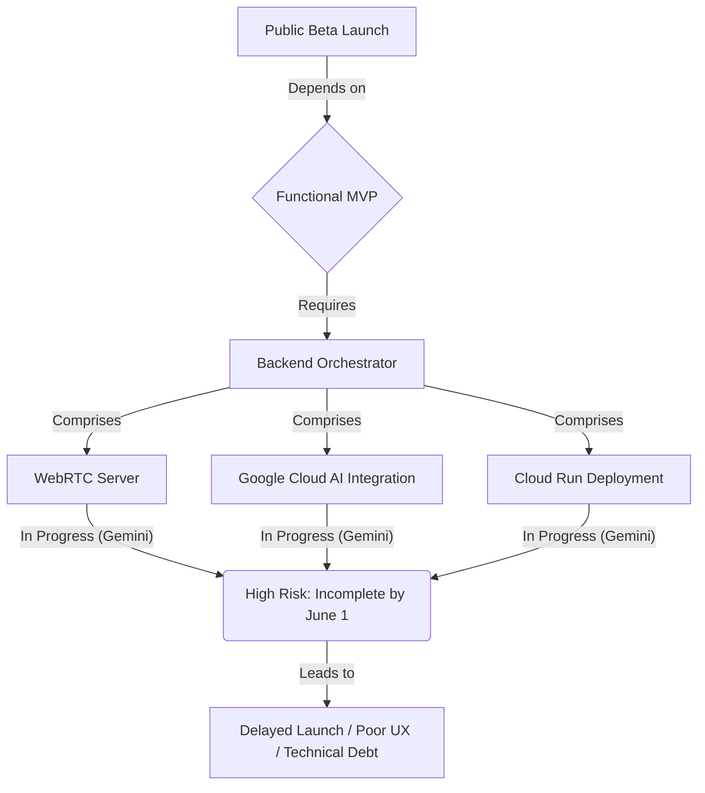

# Strategic and Architectural Analysis for VocaHire Public Beta Launch

## 1. Git Workflow (Direct Push to Main)

**Current State (lines 31-39 of CLAUDE.md):** The document explicitly states a Git workflow involving `git pull origin main --rebase` before work and `git add .`, `git commit`, `git push origin main` after completing work. This is a direct push to `main` branch.

**Analysis of Implications for Public Beta Launch:**

*   **Code Quality:** Direct pushes to `main` significantly increase the risk of introducing bugs, breaking changes, or unreviewed code into the production environment. Without a formal review process, code quality relies solely on the individual developer's diligence, which is unsustainable and prone to human error, especially under pressure (e.g., nearing a launch deadline).
*   **Collaboration:** While this workflow might seem fast for a single developer or a very small, tightly coupled team, it quickly becomes a bottleneck and a source of conflicts in a collaborative environment. It makes it difficult to track who changed what, when, and why, leading to potential overwrites and merge hell. For "Claude (Anthropic) & Gemini (Google) working asynchronously," this is a high-risk approach.
*   **Risk Management:** Direct pushes bypass critical quality gates. There's no peer review, automated checks (beyond what CI/CD might catch *after* the push), or a clear rollback strategy for individual changes. This elevates the risk of production outages, data corruption, or security vulnerabilities. For a public beta, where first impressions are crucial, this is a significant liability.

**Recommendation: Implement a Pull Request (PR) Review Process**

Implementing a PR review process is highly beneficial and critical for a public beta launch and beyond.

*   **Enhanced Code Quality:** PRs enforce code review, where peers can identify bugs, suggest improvements, ensure adherence to coding standards, and share knowledge. This collective scrutiny significantly improves code quality and reduces defects.
*   **Improved Collaboration:** PRs provide a structured way for team members to collaborate. Changes are discussed, feedback is given, and conflicts are resolved *before* merging into `main`. This fosters a shared understanding of the codebase and promotes knowledge transfer.
*   **Better Risk Management:**
    *   **Quality Gates:** PRs act as a mandatory quality gate. Automated tests (unit, integration, end-to-end), linting, and security scans can be integrated into the PR pipeline, preventing problematic code from reaching `main`.
    *   **Auditability:** Every change is linked to a PR, providing a clear audit trail of who reviewed what and when.
    *   **Rollback Capability:** If a bug is discovered post-merge, the problematic PR can be easily identified and reverted, minimizing downtime.
    *   **Staging/Pre-production Environments:** PRs facilitate deployment to staging environments for thorough testing before merging to `main` and deploying to production.

**Mermaid Diagram for Recommended Git Workflow:**

```mermaid
gitGraph
    commit id: "Initial Commit"
    branch feature/new-feature
    checkout feature/new-feature
    commit id: "Work in progress"
    commit id: "Feature complete"
    checkout main
    merge feature/new-feature id: "Create PR"
    commit id: "PR Review & Merge"
    checkout feature/another-feature
    commit id: "Another feature"
    checkout main
    merge feature/another-feature id: "Create another PR"
    commit id: "Another PR Review & Merge"
```

## 2. Phase 1 Architecture Status Contradiction

**Current State (lines 59 & 65 of CLAUDE.md):**
*   Line 59: "Phase 1: Containerization ✅" (marked as complete)
*   Line 65: "Latest changes in progress of dockerizing the project" (suggests ongoing work)

**Architectural Perspective on Completion:**

The contradiction indicates that Phase 1 is **not truly complete** from an architectural and operational standpoint. While the foundational elements (Dockerfile, Docker Compose, build scripts, API spec) might be in place and marked as "✅", the phrase "Latest changes in progress of dockerizing the project" implies that the *application itself* is still undergoing the process of being fully adapted or integrated into the containerized environment.

**Outstanding Tasks/Interpretation:**

*   **Full Application Compatibility:** "Dockerizing the project" might refer to ensuring all application components, dependencies, and configurations are correctly set up to run seamlessly within the Docker containers, not just that a Dockerfile exists. This could involve:
    *   **Environment Variable Management:** Ensuring all necessary environment variables are correctly passed into the Docker containers for different environments (dev, staging, prod).
    *   **Pathing and Volume Mounts:** Verifying that all file paths, especially for persistent storage or configuration, are correctly handled within the container and via volume mounts.
    *   **Inter-service Communication:** If there are multiple services (e.g., database, Redis, orchestrator), ensuring their communication within the Docker network is robust and correctly configured.
    *   **Build Context Optimization:** Further optimizing the Docker build process to reduce image size and build times, which is an ongoing "dockerizing" effort.
*   **Testing in Containerized Environment:** The "latest changes" could be related to fixing issues that arise only when the application runs inside the Docker container, indicating that the containerization isn't fully stable or production-ready.
*   **Documentation/Refinement:** It could also refer to the ongoing refinement of the containerization process itself, such as improving `Dockerfile.optimized` or `cloudbuild.yaml` for production deployments.

**Conclusion:** Phase 1 is likely in a state of "functional completion" where the basic infrastructure is set up, but not "operational completion" where the application is fully stable, optimized, and seamlessly integrated within the containerized environment. The "in progress" changes are critical for the stability and reliability of the containerized deployment.

## 3. Backend Orchestrator (Gemini's Progress)

**Current State (line 74 of CLAUDE.md):** "Phase 3: Backend Orchestrator (In Progress - Gemini)" with a June 1st deadline. Key tasks include "Implement WebRTC server," "Integrate Google Cloud AI services," and "Deploy to Cloud Run."

**Architectural Risk Assessment given June 1st Deadline:**

The Backend Orchestrator is explicitly identified as a "critical component" and is "In Progress" with only **3 days remaining** until the public beta launch (May 28th to June 1st). This poses an **extremely high architectural risk**.

*   **Core Functionality Dependency:** The "New Architecture Overview" (lines 207-240) clearly shows the Orchestrator as the central hub: `Browser --> WebRTC Signaling --> Orchestrator --> Google Cloud AI` and `Orchestrator --> Session State --> Database/Redis`. Without a fully functional Orchestrator, the core real-time interview functionality (WebRTC, AI integration, session management) will not work.
*   **Integration Complexity:** Implementing a WebRTC server and integrating Google Cloud AI services are complex tasks. They involve real-time communication protocols, potentially complex data streaming, and interaction with external AI APIs. Rushing these integrations in the final days significantly increases the likelihood of bugs, performance issues, and security vulnerabilities.
*   **Testing Time:** Even if the implementation is completed by May 31st, there will be minimal time for comprehensive integration testing, performance testing, and bug fixing. The "Next Steps (Today - May 28)" section lists "Backend Integration" for the afternoon of May 28th, implying a very tight window.
*   **Single Point of Failure (Gemini):** The task is assigned solely to "Gemini." While this might imply focused effort, it also creates a single point of failure. If Gemini encounters unexpected blockers or delays, there's no immediate fallback or shared responsibility to ensure completion.

**Potential Impacts on MVP if not completed on time:**

*   **Delayed Launch:** The most direct impact is a delay in the public beta launch. Without the core interview functionality, the product cannot be released.
*   **Poor User Experience:** If launched with an incomplete or buggy Orchestrator, users will experience dropped calls, AI failures, and unreliable sessions, leading to a very negative first impression and potential user churn.
*   **Technical Debt:** Rushing the implementation will likely lead to significant technical debt, making future development, maintenance, and scaling much harder.
*   **Reputational Damage:** A buggy public beta can severely damage the product's reputation and make it difficult to regain user trust.
*   **Resource Drain:** Post-launch, the team will be forced into a reactive "firefighting" mode to fix critical issues, diverting resources from planned future development.

**Mermaid Diagram for Orchestrator Criticality:**



## 4. Google Cloud Storage (GCS) for MVP

**Current State (lines 154-159 of CLAUDE.md):** "Google Cloud Storage Implementation" is marked as "Ready for MVP but optional until GCS credentials configured." It supports local file system (dev) and GCS (production).

**Architectural Determination of MVP Reliance:**

The document states GCS is "optional for MVP." To determine if this is genuinely true, we need to consider core MVP features. The primary use case for GCS in this context would be **interview recording storage**.

*   **Core MVP Features Relying on GCS:**
    *   **Interview Recording Persistence:** If the MVP includes the ability for users to *review* their past interviews (e.g., listen to audio, read transcripts, see feedback), then GCS is **not optional**. The `lib/blob-storage.ts` module suggests an abstraction for storage, implying that recordings are a feature. If recordings are meant to be persistent and accessible post-session, GCS is the production storage solution. The "Launch Checklist" (line 443) includes "Interview recording (with mock GCS)" under "Testing Required," which further suggests it's a planned feature.
    *   **Enhanced Feedback:** If enhanced feedback relies on processing stored audio/transcript data, then GCS becomes a critical dependency for that specific feature.

*   **Genuinely Optional Enhancement:**
    *   If the MVP only focuses on the *real-time interview experience* and does *not* include persistent storage or review of past interviews, then GCS could indeed be optional. In this scenario, recordings might be ephemeral or stored temporarily for immediate processing, but not for long-term user access.

**Clarification Needed:**

The key question is whether "Interview recording" (line 443) implies *persistent storage for user review*. If so, GCS is a core dependency for that specific feature. If "Interview recording" is only for internal processing (e.g., generating feedback that is then stored in the database as text), and the raw audio/video isn't meant for user access, then GCS could be deferred.

**Strategic Recommendation:**

Given the tight deadline, if "Interview recording" for user review is *not* a hard requirement for the absolute minimum viable product, then deferring GCS credential configuration is a reasonable architectural decision. However, if user access to recordings is part of the core value proposition for the public beta, then GCS setup is a critical path item. The current phrasing "Ready for MVP but optional until GCS credentials configured" suggests it *can* be deferred, but the "Testing Required" item implies it's intended to be part of the initial offering.

**Assumption for Plan:** I will assume that "Interview recording" implies persistent storage for user review, making GCS a critical, albeit currently unconfigured, component for a complete user journey.

## 5. Launch Checklist Status

**Current State (lines 464-468 of CLAUDE.md):**
*   [ ] Backend orchestrator deployed (Gemini - In Progress)
*   [ ] WebRTC connection stable (Testing needed today)
*   [ ] Credits/payments flow testing (Testing needed today)
*   [ ] Performance optimization
*   [ ] Final production testing

**Strategic Assessment and Areas of Concern:**

With only 3 days until the June 1st public beta launch, the unchecked items on the "Launch Checklist" represent significant strategic risks.

*   **Backend Orchestrator (Critical Path):** As analyzed in point 3, this is the most critical bottleneck. Its "In Progress" status directly impacts the core functionality. The plan states "Backend Integration (Afternoon - Gemini)" for May 28th, which is an extremely aggressive timeline for such a complex component.
    *   **Concern:** If the orchestrator deployment or integration fails, the entire launch is jeopardized.
*   **WebRTC Connection Stability (Critical Path):** This is directly dependent on the Backend Orchestrator. "Testing needed today" (May 28th) means there's very little buffer for identifying and fixing issues. WebRTC can be notoriously complex to stabilize across different network conditions and browsers.
    *   **Concern:** Unstable WebRTC will lead to a broken user experience, making the product unusable for many.
*   **Credits/Payments Flow Testing (Critical Path for Monetization):** "Testing needed today" (May 28th) for a payment flow is concerning. This involves external integrations (Stripe), database updates, and user credit management. Any issues here directly impact revenue and user trust.
    *   **Concern:** Bugs in payment flows can lead to lost revenue, customer frustration, and potential legal/compliance issues. Thorough testing, including edge cases and error handling, is paramount.
*   **Performance Optimization (Important, but potentially deferrable):** While important for a good user experience, "Performance optimization" might be the *only* item that could be partially deferred post-launch if absolutely necessary, provided core functionality is stable. However, the "Success Metrics" (line 381) list "< 1.5s speech-to-speech latency," which implies performance is a core NFR for MVP.
    *   **Concern:** Deferring too much performance optimization could lead to a sluggish application, impacting user retention.
*   **Final Production Testing (Absolutely Critical):** This is the ultimate gate. "Final production testing" being unchecked means the entire system hasn't been validated end-to-end in a production-like environment. This should ideally be a multi-day effort, not something squeezed into the last day.
    *   **Concern:** Skipping or rushing this step guarantees production issues.

**Strategic Plan to Ensure Completion:**

1.  **Prioritize Backend Orchestrator:** All available engineering resources (Claude and Gemini) should be focused on completing and stabilizing the Backend Orchestrator. This is the single biggest blocker.
    *   **Action:** Gemini to provide daily, if not hourly, updates on progress and any blockers. Claude to be ready to assist immediately if Gemini faces issues.
2.  **Aggressive Testing Schedule:**
    *   **WebRTC & Credits/Payments:** Dedicate specific time blocks on May 29th for rigorous testing of these flows. This includes functional, integration, and basic load testing.
    *   **Automated Tests:** Ensure existing automated tests cover these critical paths. If not, quickly implement high-priority integration tests.
    *   **Manual QA:** Conduct thorough manual testing by both Claude and Gemini, simulating real user journeys.
3.  **Risk Mitigation for Performance:**
    *   **Baseline Performance:** Establish a baseline performance metric *before* launch. If the current performance is acceptable (even if not fully optimized), defer further optimization to post-launch.
    *   **Monitoring:** Ensure robust monitoring and alerting are in place to detect performance degradation immediately after launch.
4.  **Dedicated Final Testing Window:** Allocate a significant portion of May 31st solely for "Final production testing." This should involve:
    *   End-to-end user journey testing.
    *   Testing all critical API endpoints.
    *   Verifying data integrity (e.g., credit deductions, interview recordings).
    *   Checking all external integrations (Clerk, Stripe, Google AI, GCS).
    *   Simulating concurrent users if possible.
5.  **Contingency Planning:** Prepare for a potential delay. While the June 1st deadline is firm, it's better to delay a few days for a stable launch than to launch a broken product.
    *   **Action:** Have a clear communication plan ready for stakeholders if a delay becomes necessary.

**Overall Concern:** The timeline is extremely aggressive for the remaining critical tasks, especially the Backend Orchestrator and comprehensive testing. The success hinges on flawless execution in the next 3 days.