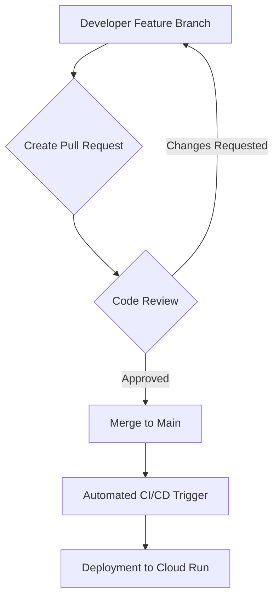

# VocaHire Strategic and Architectural Analysis

**Date**: May 28, 2025
**Project**: VocaHire MVP
**Target Launch**: June 1, 2025 (Public Beta)

This document provides a strategic and architectural analysis of key points from the `v0-vocahire/CLAUDE.md` file, considering the MVP focus and June 1st launch deadline.

---

### 1. Git Workflow (Direct Push to Main)

* **Implications of Current Workflow**: The current practice of direct pushes to `main` (lines 31-39 in `CLAUDE.md`) carries significant risks for a public beta launch:
  * **Code Quality & Stability**: Without a formal review process, there's a higher probability of introducing bugs, regressions, or security vulnerabilities directly into the production environment. This can lead to a degraded user experience and erode trust.
  * **Collaboration & Conflict**: As the team grows or development accelerates, direct pushes can lead to frequent merge conflicts, accidental overwrites, and a lack of clear ownership for changes. This hinders collaboration and can slow down development.
  * **Risk Management**: A single faulty commit can immediately break the live application. Recovering from such incidents (e.g., rollbacks) can be more complex and time-consuming without a clear, reviewed history. For a public beta, this risk is amplified as initial impressions are crucial.
* **Recommendation: Implement a Pull Request (PR) Review Process**:
  * **Benefit**: A PR review process is highly beneficial and strongly recommended. It provides a critical gatekeeping mechanism before code merges into `main`.
    * **Quality Assurance**: Enables peer review, catching bugs, design flaws, and adherence to coding standards before deployment.
    * **Knowledge Sharing**: Facilitates code understanding across the team and helps onboard new developers.
    * **Reduced Risk**: Minimizes the chance of breaking production, as changes are vetted and approved. Provides a clear history of changes and easier rollbacks if issues arise post-merge.
    * **Improved Collaboration**: Encourages discussion, feedback, and collective ownership of the codebase.

**Proposed Git Workflow with PRs:**

---

### 2. Phase 1 Architecture Status Contradiction

* **Clarification**: The `CLAUDE.md` document states "Phase 1: Containerization" is "✅" (line 59) and "Overall Status: ✅ SUCCESSFULLY DEPLOYED TO CLOUD RUN! 🚀" (line 12). However, it also notes "Latest changes in progress of dockerizing the project" (line 65).
* **Architectural Perspective**: This is not a fundamental contradiction but rather an indication of continuous improvement. "Phase 1: Containerization" being "✅" likely signifies that the project *is* successfully containerized and deployed to Cloud Run, fulfilling the basic requirement. The "Latest changes in progress of dockerizing the project" suggests ongoing efforts to optimize the Docker images (e.g., reducing size, improving build times) or refine the containerization strategy for better performance, security, or maintainability. For the MVP, the current state is functionally complete and deployed, but there are known areas for further architectural refinement post-launch.

---

### 3. Backend Orchestrator (Gemini's Progress)

* **Status**: "Phase 3: Backend Orchestrator" is "In Progress - Gemini" (line 74) and is explicitly stated as critical for real-time voice Q&A.
* **Risks & Potential Impacts on MVP (June 1st Deadline)**:
  * **Core Feature Failure**: The "Real-time AI Conversations" (line 20) is a core value proposition. If the backend orchestrator, which is critical for this, is not completed and stable by June 1st, the MVP will fail to deliver its primary functionality. This is the most significant risk to the launch.
  * **Delayed Launch**: If the orchestrator is not ready, the public beta launch will likely need to be delayed, impacting user acquisition and initial market feedback.
  * **Subpar User Experience**: Even if a partial or unstable version is deployed, it could lead to high latency, dropped connections, or inaccurate AI responses, severely damaging the user's "wow" moment and leading to negative reviews.
  * **Increased Technical Debt**: Rushing the completion in the final days could lead to quick fixes, poor code quality, and increased technical debt, making future development and scaling more challenging.

---

### 4. Google Cloud Storage (GCS) for MVP

* **Architectural Determination**: Based on the `CLAUDE.md` document, GCS is *not* a core MVP feature and is explicitly stated as "Removed Google Cloud Storage - Not needed for MVP" (line 62) and "No Audio Recording Storage" (line 26). The current architecture relies on Server-Sent Events (SSE) for real-time voice interaction, not on storing audio recordings. Therefore, GCS is genuinely an optional enhancement that can be deferred post-launch without impacting the core MVP functionality. The user's assumption about "interview recording storage" is directly contradicted by the document's MVP decisions.

---

### 5. Launch Checklist Status

* **Strategic Assessment of Unchecked Items**:
  * **"Backend orchestrator deployed"**: This is the most critical unchecked item, directly dependent on the completion of the "Backend Orchestrator (Gemini's Progress)" (Point 3). Its deployment is a prerequisite for the core real-time AI conversation feature.
  * **"WebRTC connection stable"**: This item appears to be outdated. The document explicitly states "No WebRTC Peer-to-Peer - Using Server-Sent Events (SSE) with Google AI" (line 27) and "Removed WebRTC Components - Using SSE instead" (line 63). This item should be removed from the critical path or updated to reflect SSE stability.
  * **"Credits/payments flow testing"**: While the "Payment System - Stripe ready for credit purchases" is "✅" (line 21), the *testing* of the full user journey and payment flow verification (lines 159-160) is still pending. This is a high-priority item to ensure monetization works correctly and users have a smooth experience purchasing credits.
  * **"Final production testing"**: This is a broad but essential item. It should encompass end-to-end testing, performance testing (including load testing as mentioned on line 161), security testing, and error handling validation in a production-like environment.
* **Potential Bottlenecks & Areas of Concern**:
  * **Backend Orchestrator Completion**: This remains the primary bottleneck. All efforts should be focused on stabilizing and deploying this component.
  * **Outdated Checklist**: The presence of the "WebRTC connection stable" item indicates a potential disconnect between the documented architectural decisions and the launch checklist. This needs immediate rectification to ensure focus on relevant tasks.
  * **Testing Scope & Time**: With only 3 days until launch, the remaining testing items ("Full user journey testing", "Payment flow verification", "Load testing core API", "Final production testing") are ambitious. There's a risk of insufficient testing, leading to post-launch issues. Prioritization of critical paths and robust error handling is key.
  * **Monitoring Setup**: "Monitoring setup" (line 170) is also unchecked. Without proper monitoring, identifying and reacting to issues post-launch will be significantly harder.

### Detailed Plan for Addressing Remaining Items

**Goal:** Ensure VocaHire is ready for its June 1st public beta launch by addressing critical architectural and strategic points.

**Phase 1: Immediate Clarification & Prioritization (Today)**

1. **Verify Backend Orchestrator Status**:
    * **Action**: Confirm the exact status and estimated completion of the "Backend Orchestrator (Gemini)" with the development team.
    * **Expected Outcome**: A clear understanding of whether it will be ready for deployment by June 1st.
    * **Next Steps**: If not on track, immediately assess contingency plans (e.g., simplified MVP, delayed launch).

2. **Update Launch Checklist**:
    * **Action**: Remove or rephrase the "WebRTC connection stable" item to reflect the shift to SSE. Focus on "SSE connection stable" or "Real-time AI conversation stability".
    * **Expected Outcome**: A streamlined and accurate launch checklist.

**Phase 2: Critical Path Execution (Next 2 Days)**

1. **Backend Orchestrator Deployment & Testing**:
    * **Action**: Once the Backend Orchestrator is complete, prioritize its deployment to Cloud Run.
    * **Action**: Conduct immediate, focused testing on the real-time AI conversation flow, ensuring low latency and stability.
    * **Expected Outcome**: Stable and functional core AI conversation experience in production.

2. **Comprehensive User Journey & Payment Flow Testing**:
    * **Action**: Execute full end-to-end user journey tests, including sign-up, free credit usage, credit purchase (Stripe integration), and premium access.
    * **Action**: Specifically verify all payment flows, including successful transactions, failed transactions, and edge cases.
    * **Expected Outcome**: Confidence in the monetization pipeline and a smooth user experience for credit management.

3. **Final Production Testing & Monitoring**:
    * **Action**: Perform load testing on the core API to identify performance bottlenecks under anticipated user traffic.
    * **Action**: Conduct final production testing, focusing on overall system stability, error handling, and graceful degradation.
    * **Action**: Ensure monitoring and alerting systems are fully configured and tested to detect and notify of issues post-launch.
    * **Expected Outcome**: A robust and observable production environment.

**Phase 3: Post-Launch Iteration (After June 1st)**

1. **Implement PR Review Workflow**:
    * **Action**: Introduce a formal Pull Request (PR) review process for all code merges to `main`. This includes defining review guidelines, requiring at least one approval, and integrating with CI/CD.
    * **Expected Outcome**: Improved code quality, enhanced collaboration, and reduced risk for future development.

2. **GCS Integration (Optional)**:
    * **Action**: If future features require file storage (e.g., interview recording storage), plan and implement GCS integration as a separate phase.
    * **Expected Outcome**: Scalable and reliable file storage as needed.

3. **Dockerization Optimization**:
    * **Action**: Continue refining Dockerfiles and build processes for efficiency and security.
    * **Expected Outcome**: Optimized deployment artifacts and faster CI/CD cycles.

### Conclusion

The VocaHire project is on the cusp of a public beta launch, with significant progress made on core features. The most critical immediate concern is the completion and deployment of the Backend Orchestrator, which is essential for the core real-time AI conversation experience. Additionally, a robust testing phase, particularly for payment flows and overall production stability, is paramount given the tight deadline. Implementing a PR review process post-launch will be crucial for maintaining code quality and fostering collaboration as the project evolves.
