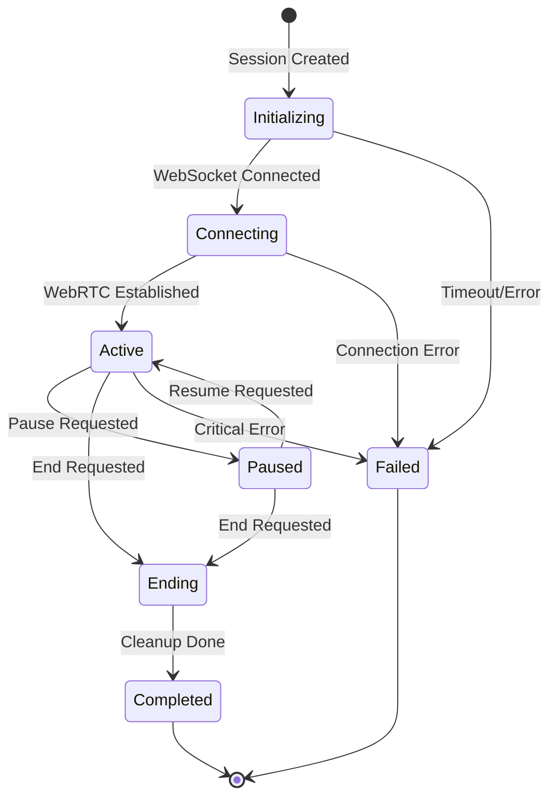

# VocaHire Backend Orchestrator API Specification

**Document Version**: 1.1  
**Date**: May 26, 2025  
**Author**: Claude (AI Developer)  
**Purpose**: Define the API contract between VocaHire client applications and the backend orchestration service

## 📋 Overview

This document specifies the API interface for VocaHire's backend orchestration service, which manages real-time AI-powered interview sessions. The API is designed for deployment as a containerized Cloud Run service and supports WebRTC-based audio streaming with Google Cloud AI services.

## 🏗️ Architecture Context

```
┌─────────────────┐         ┌──────────────────┐         ┌────────────────────┐
│  Client (React) │ WebRTC  │  AI Orchestrator │  APIs   │ Google Cloud AI    │
│  InterviewRoom  │◄───────►│  (Cloud Run)     │◄───────►│ STT, TTS, Vertex   │
└─────────────────┘         └──────────────────┘         └────────────────────┘
        │                            │
        │ HTTP                       │ HTTP
        ▼                            ▼
┌─────────────────┐         ┌──────────────────┐
│  API Gateway    │         │  Session Store   │
│  (Cloud Run)    │         │  (Redis/DB)      │
└─────────────────┘         └──────────────────┘
```

## 🔌 Service Endpoints

### Base URL
```
Production: https://ai-orchestrator-xxxxx-uc.a.run.app
Development: http://localhost:5000
```

### Health Check Endpoints

#### GET /health
**Purpose**: Basic health check for Cloud Run  
**Response**:
```json
{
  "status": "healthy",
  "timestamp": "2025-05-25T10:00:00Z",
  "version": "1.0.0",
  "uptime": 3600
}
```

#### GET /ready
**Purpose**: Readiness check including dependency validation  
**Response**:
```json
{
  "status": "ready",
  "services": {
    "redis": "connected",
    "google_stt": "authenticated",
    "google_tts": "authenticated",
    "vertex_ai": "authenticated"
  }
}
```

### Session Management Endpoints

#### POST /api/v1/sessions/create
**Purpose**: Initialize a new interview session  
**Headers**:
```
Authorization: Bearer <jwt_token>
Content-Type: application/json
```

**Request Body**:
```json
{
  "userId": "user_2NNEqSsxWFZK5GuE2PvYnJqKVdN",
  "jobTitle": "Senior Software Engineer",
  "resumeContext": "10 years experience in full-stack development...",
  "interviewType": "technical", // technical, behavioral, mixed
  "preferences": {
    "difficulty": "senior", // junior, mid, senior
    "duration": 30, // minutes
    "focusAreas": ["system-design", "coding", "leadership"]
  }
}
```

**Response** (200 OK):
```json
{
  "sessionId": "sess_a1b2c3d4e5f6",
  "status": "initializing",
  "iceServers": [
    {
      "urls": "stun:stun.l.google.com:19302"
    },
    {
      "urls": "turn:turn.vocahire.com:3478",
      "username": "temp_user",
      "credential": "temp_pass"
    }
  ],
  "websocketUrl": "wss://ai-orchestrator-xxxxx-uc.a.run.app/ws/sess_a1b2c3d4e5f6",
  "expiresAt": "2025-05-25T11:00:00Z"
}
```

**Error Responses**:
- `401 Unauthorized`: Invalid or missing authentication
- `403 Forbidden`: Insufficient credits or permissions
- `429 Too Many Requests`: Rate limit exceeded
- `503 Service Unavailable`: Service temporarily unavailable

#### GET /api/v1/sessions/:sessionId
**Purpose**: Retrieve session status and metadata  
**Response**:
```json
{
  "sessionId": "sess_a1b2c3d4e5f6",
  "status": "active", // initializing, active, completed, failed
  "startedAt": "2025-05-25T10:00:00Z",
  "duration": 300, // seconds
  "messageCount": 15,
  "lastActivity": "2025-05-25T10:05:00Z"
}
```

#### POST /api/v1/sessions/:sessionId/end
**Purpose**: Gracefully end an interview session  
**Response**:
```json
{
  "sessionId": "sess_a1b2c3d4e5f6",
  "status": "completed",
  "duration": 1800,
  "transcriptUrl": "/api/v1/sessions/sess_a1b2c3d4e5f6/transcript"
}
```

## 🔄 WebSocket Protocol

### Connection URL
```
wss://ai-orchestrator-xxxxx-uc.a.run.app/ws/:sessionId
```

### Authentication
Include JWT token as query parameter:
```
wss://ai-orchestrator-xxxxx-uc.a.run.app/ws/sess_a1b2c3d4e5f6?token=<jwt_token>
```

### Connection Flow
1. Client creates session via `POST /api/v1/sessions/create`
2. Client establishes WebSocket connection using returned `websocketUrl`
3. Server sends `session.status` with `status: "connected"`
4. Client creates RTCPeerConnection with provided `iceServers`
5. Client sends `webrtc.offer` via WebSocket
6. Server responds with `webrtc.answer`
7. Both exchange `webrtc.ice_candidate` messages
8. Once WebRTC is established, audio flows directly
9. Transcripts and control messages flow via WebSocket

### Message Format

All WebSocket messages follow this structure:
```typescript
interface WebSocketMessage {
  type: string;
  timestamp: string;
  data: any;
  metadata?: {
    sequenceId?: number;
    correlationId?: string;
  };
}
```

### Client → Server Messages

#### webrtc.offer
**Purpose**: Send WebRTC offer to establish peer connection
```json
{
  "type": "webrtc.offer",
  "timestamp": "2025-05-25T10:00:00Z",
  "data": {
    "sdp": "v=0\r\no=- 4611731400430051336 2 IN IP4 127.0.0.1\r\n...",
    "type": "offer"
  }
}
```

#### webrtc.ice_candidate
**Purpose**: Send ICE candidate for connection establishment
```json
{
  "type": "webrtc.ice_candidate",
  "timestamp": "2025-05-25T10:00:00Z",
  "data": {
    "candidate": "candidate:1 1 UDP 2122260223 192.168.1.100 54321 typ host",
    "sdpMLineIndex": 0,
    "sdpMid": "0"
  }
}
```

#### control.start_interview
**Purpose**: Signal to begin the interview
```json
{
  "type": "control.start_interview",
  "timestamp": "2025-05-25T10:00:00Z",
  "data": {}
}
```

#### control.pause
**Purpose**: Pause the interview
```json
{
  "type": "control.pause",
  "timestamp": "2025-05-25T10:00:00Z",
  "data": {
    "reason": "user_requested" // user_requested, technical_issue
  }
}
```

#### control.resume
**Purpose**: Resume a paused interview
```json
{
  "type": "control.resume",
  "timestamp": "2025-05-25T10:00:00Z",
  "data": {}
}
```

#### user.interrupt
**Purpose**: Signal user interruption for barge-in handling
```json
{
  "type": "user.interrupt",
  "timestamp": "2025-05-25T10:00:00Z",
  "data": {
    "reason": "user_speaking"
  }
}
```

### Server → Client Messages

#### webrtc.answer
**Purpose**: Send WebRTC answer to complete connection
```json
{
  "type": "webrtc.answer",
  "timestamp": "2025-05-25T10:00:00Z",
  "data": {
    "sdp": "v=0\r\no=- 4611731400430051336 2 IN IP4 127.0.0.1\r\n...",
    "type": "answer"
  }
}
```

#### webrtc.ice_candidate
**Purpose**: Send server's ICE candidates
```json
{
  "type": "webrtc.ice_candidate",
  "timestamp": "2025-05-25T10:00:00Z",
  "data": {
    "candidate": "candidate:1 1 UDP 2122260223 10.0.0.1 12345 typ host",
    "sdpMLineIndex": 0,
    "sdpMid": "0"
  }
}
```

#### session.status
**Purpose**: Update session status
```json
{
  "type": "session.status",
  "timestamp": "2025-05-25T10:00:00Z",
  "data": {
    "status": "active", // initializing, active, paused, ending, completed
    "message": "Interview session is now active"
  }
}
```

#### transcript.user
**Purpose**: User speech transcription
```json
{
  "type": "transcript.user",
  "timestamp": "2025-05-25T10:00:00Z",
  "data": {
    "text": "I have 5 years of experience with React and Node.js",
    "isFinal": true,
    "confidence": 0.95,
    "words": [
      {
        "word": "I",
        "startTime": 0.0,
        "endTime": 0.1,
        "confidence": 0.99
      }
    ]
  },
  "metadata": {
    "sequenceId": 42
  }
}
```

#### transcript.ai
**Purpose**: AI speech transcription
```json
{
  "type": "transcript.ai",
  "timestamp": "2025-05-25T10:00:00Z",
  "data": {
    "text": "That's excellent experience. Can you tell me about a challenging project?",
    "isFinal": true,
    "emotion": "encouraging", // neutral, encouraging, challenging
    "intent": "follow_up_question"
  },
  "metadata": {
    "sequenceId": 43
  }
}
```

#### audio.level
**Purpose**: Audio level indicators for UI visualization
```json
{
  "type": "audio.level",
  "timestamp": "2025-05-25T10:00:00Z",
  "data": {
    "userLevel": 0.7, // 0.0 to 1.0
    "aiLevel": 0.0
  }
}
```

#### ai.thinking
**Purpose**: Indicate AI is processing
```json
{
  "type": "ai.thinking",
  "timestamp": "2025-05-25T10:00:00Z",
  "data": {
    "status": "processing", // processing, generating_response
    "estimatedDuration": 2000 // milliseconds
  }
}
```

#### conversation.turn
**Purpose**: Turn-taking management
```json
{
  "type": "conversation.turn",
  "timestamp": "2025-05-25T10:00:00Z",
  "data": {
    "speaker": "ai", // user, ai
    "action": "speaking" // speaking, listening, waiting
  }
}
```

#### error
**Purpose**: Error notifications
```json
{
  "type": "error",
  "timestamp": "2025-05-25T10:00:00Z",
  "data": {
    "code": "STT_ERROR",
    "message": "Speech recognition temporarily unavailable",
    "severity": "warning", // info, warning, error, critical
    "recoverable": true
  }
}
```

## 🎵 WebRTC Data Channel Protocol

### Channel Name
```
vocahire-control
```

### Message Types

#### Heartbeat
**Purpose**: Keep connection alive and measure latency
```json
{
  "type": "heartbeat",
  "timestamp": "2025-05-25T10:00:00Z",
  "data": {
    "ping": 1234567890
  }
}
```

Response:
```json
{
  "type": "heartbeat_ack",
  "timestamp": "2025-05-25T10:00:01Z",
  "data": {
    "pong": 1234567890,
    "serverTime": "2025-05-25T10:00:01Z"
  }
}
```

#### Audio Metadata
**Purpose**: Coordinate audio streaming
```json
{
  "type": "audio.metadata",
  "timestamp": "2025-05-25T10:00:00Z",
  "data": {
    "format": "opus",
    "sampleRate": 48000,
    "channels": 1,
    "chunkDuration": 20 // milliseconds
  }
}
```

## 📊 State Transitions



## 🚨 Error Codes

| Code | Description | HTTP Status | Recoverable |
|------|-------------|-------------|-------------|
| `AUTH_INVALID` | Invalid authentication token | 401 | No |
| `CREDITS_INSUFFICIENT` | Not enough VocahireCredits | 403 | No |
| `SESSION_NOT_FOUND` | Session ID doesn't exist | 404 | No |
| `SESSION_EXPIRED` | Session has expired | 410 | No |
| `RATE_LIMIT_EXCEEDED` | Too many requests | 429 | Yes |
| `STT_ERROR` | Speech-to-text service error | 502 | Yes |
| `TTS_ERROR` | Text-to-speech service error | 502 | Yes |
| `LLM_ERROR` | Language model service error | 502 | Yes |
| `WEBRTC_ERROR` | WebRTC connection error | 500 | Yes |
| `INTERNAL_ERROR` | Unexpected server error | 500 | Maybe |
| `SERVICE_UNAVAILABLE` | Service temporarily down | 503 | Yes |

## 🔐 Security Considerations

### Authentication
- All HTTP endpoints require JWT bearer token
- WebSocket connections authenticated via query parameter
- Tokens expire after 1 hour

### Rate Limiting
- Session creation: 5 per minute per user
- WebSocket messages: 100 per minute per connection
- API calls: 1000 per hour per user

### Data Validation
- All inputs validated against JSON schemas
- Maximum message size: 64KB
- Maximum audio chunk: 1MB

## 📦 Integration with Docker Architecture

### Service Discovery
```yaml
# Environment variables for service URLs
API_GATEWAY_URL: http://api-gateway:4000
REDIS_URL: redis://redis:6379
```

### Health Checks for Cloud Run
```dockerfile
HEALTHCHECK --interval=30s --timeout=3s --start-period=5s --retries=3 \
  CMD node healthcheck.js || exit 1
```

### Logging Format
```json
{
  "severity": "INFO",
  "timestamp": "2025-05-25T10:00:00Z",
  "labels": {
    "service": "ai-orchestrator",
    "sessionId": "sess_a1b2c3d4e5f6",
    "userId": "user_2NNEqSsxWFZK5GuE2PvYnJqKVdN"
  },
  "message": "Session started",
  "httpRequest": {
    "requestMethod": "POST",
    "requestUrl": "/api/v1/sessions/create",
    "status": 200,
    "latency": "0.123s"
  }
}
```

## 🧪 Testing Endpoints

### POST /api/v1/test/echo
**Purpose**: Test WebSocket echo for development
```json
{
  "message": "Hello, World!"
}
```

### GET /api/v1/test/simulate-interview
**Purpose**: Simulate interview without consuming credits
**Query Parameters**:
- `duration`: Simulation duration in seconds (default: 60)
- `scenario`: Test scenario (default: "basic")

## 📈 Performance Requirements

### Latency Targets
- Session creation: < 500ms
- WebSocket message delivery: < 50ms
- Audio streaming latency: < 200ms
- End-to-end speech response: < 1.5s

### Scalability
- Support 1000 concurrent sessions
- Handle 10,000 messages per second
- Auto-scale based on CPU/memory usage

## 🔄 Client Implementation Guide

### React Hook Integration
```typescript
// Example usage in useRealtimeInterviewSession.ts

// 1. Create session
const response = await fetch('/api/sessions/create', {
  method: 'POST',
  headers: {
    'Authorization': `Bearer ${authToken}`,
    'Content-Type': 'application/json'
  },
  body: JSON.stringify({
    userId,
    jobTitle,
    resumeContext,
    interviewType: 'behavioral',
    preferences: { difficulty: 'senior', duration: 30 }
  })
});

const { sessionId, websocketUrl, iceServers } = await response.json();

// 2. Establish WebSocket
const ws = new WebSocket(`${websocketUrl}?token=${authToken}`);

// 3. Create peer connection
const pc = new RTCPeerConnection({ iceServers });

// 4. Add local audio stream
const stream = await navigator.mediaDevices.getUserMedia({ audio: true });
stream.getTracks().forEach(track => pc.addTrack(track, stream));

// 5. Handle ICE candidates
pc.onicecandidate = (event) => {
  if (event.candidate) {
    ws.send(JSON.stringify({
      type: 'webrtc.ice_candidate',
      timestamp: new Date().toISOString(),
      data: {
        candidate: event.candidate.candidate,
        sdpMLineIndex: event.candidate.sdpMLineIndex,
        sdpMid: event.candidate.sdpMid
      }
    }));
  }
};

// 6. Create and send offer
const offer = await pc.createOffer();
await pc.setLocalDescription(offer);

ws.send(JSON.stringify({
  type: 'webrtc.offer',
  timestamp: new Date().toISOString(),
  data: {
    sdp: offer.sdp,
    type: 'offer'
  }
}));

// 7. Handle WebSocket messages
ws.onmessage = async (event) => {
  const message = JSON.parse(event.data);
  
  switch (message.type) {
    case 'webrtc.answer':
      await pc.setRemoteDescription(
        new RTCSessionDescription(message.data)
      );
      break;
      
    case 'webrtc.ice_candidate':
      await pc.addIceCandidate(
        new RTCIceCandidate(message.data)
      );
      break;
      
    case 'transcript.user':
      handleUserTranscript(message.data);
      break;
      
    case 'transcript.ai':
      handleAITranscript(message.data);
      break;
      
    case 'session.status':
      updateSessionStatus(message.data);
      break;
      
    case 'ai.thinking':
      showThinkingIndicator(message.data);
      break;
      
    case 'error':
      handleError(message.data);
      break;
  }
};

// 8. Start interview when ready
ws.send(JSON.stringify({
  type: 'control.start_interview',
  timestamp: new Date().toISOString(),
  data: {}
}));
```

### Error Handling
```typescript
// Implement exponential backoff for reconnection
let reconnectDelay = 1000;
const maxReconnectDelay = 30000;

function reconnect() {
  setTimeout(() => {
    connect();
    reconnectDelay = Math.min(reconnectDelay * 2, maxReconnectDelay);
  }, reconnectDelay);
}

ws.onerror = (error) => {
  console.error('WebSocket error:', error);
  if (isRecoverable(error)) {
    reconnect();
  }
};
```

## 📝 Key Implementation Notes for Client

### Session Lifecycle Management
1. **Session Creation**: Always check for sufficient credits before creating
2. **Connection Management**: Maintain both WebSocket and WebRTC connections
3. **Audio Flow**: User audio → WebRTC → Backend → Google STT/TTS → WebRTC → Speaker
4. **Data Flow**: Transcripts, status, control → WebSocket
5. **Cleanup**: Always call `/end` endpoint and close connections properly

### State Synchronization
- Session state is source of truth on server
- Client should react to server state changes
- Don't assume local actions succeeded until confirmed

### Audio Configuration
```typescript
const audioConstraints = {
  audio: {
    echoCancellation: true,
    noiseSuppression: true,
    autoGainControl: true,
    sampleRate: 48000
  }
};
```

## 📝 Version History

| Version | Date | Changes |
|---------|------|---------|
| 1.0 | 2025-05-25 | Initial specification |
| 1.1 | 2025-05-26 | Added connection flow, enhanced client guide |

---

*This specification serves as the contract between the VocaHire client applications and the backend orchestration service. Both Claude and Gemini should reference this document when implementing their respective components.*